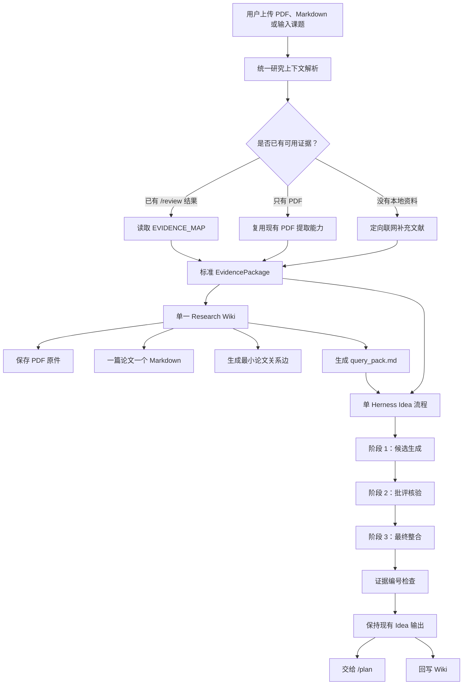

# 7 月 31 日 `/wiki` 与 `/idea` 轻量改造计划

## 一、计划目标

本计划只优化 `research-agent-platform` 中的 `/wiki` 和 `/idea` 两个模块，其他科研流程保持不变。

核心目标：

1. `/wiki` 能真正保存上传的 PDF，并为每篇论文生成一个可持续更新的 Markdown 总结。
2. 第一版只建设一个 Wiki，不再拆分独立 Wiki、图谱服务和向量数据库。
3. 图谱暂不作为独立模块，只保留少量、可验证的论文关系边。
4. `/idea` 不增加多个独立 Agent 对象，继续使用一个 Herness（轻量编排器）完成多个阶段。
5. Herness 的不同阶段可以选择不同模型，也允许全部阶段使用同一个模型。
6. 保留现有 `/review`、`/idea`、`/plan`、`/write` 等命令和产物路径，避免破坏其他模块。
7. 精简当前 Skill（技能）注入，确保保留下来的 Skill 对当前阶段真正有用。

本轮原则：

- 先把真实输入、存储、检索和证据链做好。
- 不引入 Neo4j、Elasticsearch 或独立图数据库服务。
- 不重复实现 `/review` 已经具备的 PDF 解析能力。
- 不为了“多 Agent”概念增加不必要的类和流程。
- 对外输入输出尽量不变，内部实现可以逐步替换。

---

## 二、当前模块的真实情况

### 2.1 当前 `/idea` 输入

当前 `/idea` 的主要输入是：

1. 用户输入的课题、研究方向或想法；
2. 当前会话以前产生的任务和 Markdown 产物；
3. 如果存在，优先读取：
   - `bib/EVIDENCE_MAP.md`
   - `bib/LITERATURE_REVIEW.md`
4. 如果没有上述文献结果，则执行一次定向联网检索，生成：
   - `bib/LITERATURE_SEARCH.md`
   - `bib/LITERATURE_SEARCH.json`

当前 `/idea` 不直接解析原始 PDF。PDF 的文本和页码证据主要由 `/review` 提取。

### 2.2 当前 `/idea` 输出

现有输出路径保持不变：

```text
idea/IDEA_CANDIDATES.md
idea/IDEA_VERIFICATION.md
idea/FINAL_IDEA.md
idea/docs/research_contract.md
```

职责保持：

- `IDEA_CANDIDATES.md`：三个候选 Idea；
- `IDEA_VERIFICATION.md`：新颖性、可行性、反对证据和风险检查；
- `FINAL_IDEA.md`：最终研究想法；
- `research_contract.md`：交给 `/plan` 的结构化交接材料。

完整实验方案继续由 `/plan` 生成，避免 `/idea` 和实验模块重复。

### 2.3 当前 `/wiki` 输入

当前 `/wiki` 只读取：

- 用户当前的文字请求；
- 当前会话已有任务摘要；
- 当前会话已有 Markdown、JSON 等产物摘要。

它不会主动解析上传的 PDF，也不会把 PDF 组织成逐篇论文 Wiki。

### 2.4 当前 `/wiki` 输出

当前输出：

```text
wiki/KNOWLEDGE_DIGEST.md
wiki/MEMORY_UPDATE.md
wiki/agent-notes/<task_id>.md
```

这些文件只是任务知识摘要和文件索引，不是真正的论文 Wiki，也没有真实图谱存储。

---

## 三、目标总体流程



---

## 四、单一 Wiki 设计

### 4.1 设计原则

Wiki 是唯一的科研知识沉淀入口，同时保存三类内容：

1. 原始 PDF：保留最终可核查资料；
2. 论文 Markdown：便于人和模型阅读；
3. 少量结构化关系：支持检索和后续 Idea 生成。

第一版不建设独立图谱服务，不做复杂图算法和图数据库部署。

### 4.2 目录结构

建议在每个会话工作区中使用：

```text
wiki/
├── index.md
├── query_pack.md
├── papers/
│   ├── P001/
│   │   ├── source.pdf
│   │   └── summary.md
│   └── P002/
│       ├── source.pdf
│       └── summary.md
├── ideas/
│   └── idea-001.md
├── relations.jsonl
├── KNOWLEDGE_DIGEST.md
├── MEMORY_UPDATE.md
└── agent-notes/
```

为了兼容现有模块，原有 PDF 不移动：

```text
bib/papers/<原始文件>.pdf
paper/uploads/<原始文件>.pdf
```

Wiki 首次纳入论文时，将 PDF 复制到：

```text
wiki/papers/<paper_id>/source.pdf
```

暂时采用复制而不是移动，避免 `/review`、`/write`、下载和云同步流程因路径变化而失效。

后续如果确认所有模块都改为从 Wiki 取文件，再讨论是否只保留一份物理文件。

### 4.3 一篇论文一个 Markdown

每篇论文生成：

```text
wiki/papers/<paper_id>/summary.md
```

统一包含以下内容：

```text
# 论文标题

## 基本信息
- Paper ID
- 作者
- 年份
- DOI / arXiv ID
- 原始 PDF 路径

## 研究问题

## 核心方法

## 数据集与实验设置

## 主要结果

## 作者讨论与局限

## 作者提出的未来工作

## 可复用证据
- Evidence ID
- 页码
- 简短原文或忠实摘要

## 与其他论文的关系

## 对 Idea 生成的提示
```

要求：

- 结论尽量绑定页码和 Evidence ID；
- 明确区分“论文作者明确说明”和“模型推断”；
- 没有读取到的内容标记为“不确定”，不能补写；
- 再次导入同一论文时更新原页面，不创建重复页面。

### 4.4 最小关系边

第一版只保留 `wiki/relations.jsonl`，不单独建设图谱数据库和前端。

每行表示一条关系：

```json
{"source":"paper:P001","target":"paper:P002","relation":"cites","evidence":"reference match"}
```

首期只支持三种关系：

1. `cites`：引用关系，必须由参考文献、DOI 或标题匹配得到；
2. `related_to`：共享明确的方法、数据集或任务，标记为低置信度关系；
3. `idea_based_on`：最终 Idea 与来源论文之间的关系。

暂不实现：

- 自动社区发现；
- 复杂图谱推理；
- 中心性计算；
- 单独的图谱可视化页面；
- Claim、Experiment、Gap 等大量节点类型。

后续确有需求时，可从 `relations.jsonl` 导出简单 `graph.json`，不影响 Wiki 主流程。

### 4.5 Wiki 检索输出

Wiki 给 `/idea` 提供统一的：

```text
wiki/query_pack.md
```

内容控制在约 8,000 字符内，包括：

- 最相关论文；
- 主要方法；
- 作者明确提出的局限和未来工作；
- 已知相似 Idea；
- 已经失败或风险较大的方向；
- 可供 Idea 使用的 Evidence ID；
- 证据不足和冲突信息。

`/idea` 不直接扫描整个 Wiki，只读取针对当前课题生成的 `query_pack.md` 和必要证据，控制上下文长度。

---

## 五、统一输入解析

### 5.1 新增统一接口

建议增加：

```text
src/research_agent_platform/context/resolver.py
```

核心接口：

```python
resolve_research_context(session_id, objective) -> EvidencePackage
```

`EvidencePackage` 至少包含：

```text
topic
source_files
papers
evidence_records
evidence_ids
existing_review_artifacts
external_search_records
limitations
```

### 5.2 解析优先级

按以下顺序处理：

1. 存在 `bib/EVIDENCE_MAP.md`：直接复用；
2. 没有 Evidence Map，但 Wiki 已收录论文：从 Wiki 检索；
3. 有上传 PDF：复用现有 `collect_paper_evidence()` 提取页码级证据；
4. 没有本地材料：执行现有定向学术检索；
5. 全部失败：返回证据不足，不允许 Idea 假装已经调研。

### 5.3 模块职责

- PDF 提取逻辑只保留一份；
- `/review`、`/wiki` 和 `/idea` 共同调用输入解析器；
- `/wiki` 负责长期保存解析结果；
- `/idea` 只消费整理好的证据和 Wiki 检索结果；
- 不在 `/idea` 内部重新实现 PDF 解析器。

---

## 六、单 Herness Idea 设计

### 6.1 保留现有三阶段

继续使用：

```text
idea_candidates
idea_verification
final_idea
```

不新增 ProducerAgent、CriticAgent 等独立类。

准确定位为：

> 一个 Herness（轻量编排器）管理三个角色阶段，并允许每个阶段选择不同模型。

### 6.2 阶段模型路由

在 `StageDefinition` 中增加：

```python
model_role: str = "default"
```

配置：

```text
idea_candidates     -> idea_generator
idea_verification   -> idea_critic
final_idea          -> idea_finalizer
```

环境变量：

```text
IDEA_GENERATOR_MODEL=
IDEA_CRITIC_MODEL=
IDEA_FINAL_MODEL=
UPSTREAM_MODEL=
```

规则：

1. 阶段模型已配置：使用对应模型；
2. 阶段模型未配置：回退到 `UPSTREAM_MODEL`；
3. 所有阶段允许使用同一个模型；
4. 批评阶段推荐使用不同模型家族，但不作为强制要求；
5. 某个模型调用失败时，回退到默认模型并记录原因。

### 6.3 三阶段输入

#### 阶段一：候选生成

输入：

- 用户课题；
- `query_pack.md`；
- 与课题最相关的 Evidence；
- 用户限制条件。

输出保持：

```text
idea/IDEA_CANDIDATES.md
```

#### 阶段二：批评核验

输入：

- 候选 Idea；
- 独立重新检索的最近前例；
- 反对证据；
- 失败条件；
- 已知实验范式。

批评阶段使用新的模型请求，不继承生成阶段隐藏上下文，只读取候选文件和可验证证据。

输出保持：

```text
idea/IDEA_VERIFICATION.md
```

#### 阶段三：最终整合

输入：

- 候选 Idea；
- 批评结果；
- Evidence ID 列表；
- Wiki 中已存在的相似 Idea；
- 用户限制条件。

输出保持：

```text
idea/FINAL_IDEA.md
idea/docs/research_contract.md
```

### 6.4 证据检查

最终输出前增加轻量确定性检查：

1. Idea 中出现的 Evidence ID 必须真实存在；
2. 引用论文 ID 必须来自 Wiki 或检索结果；
3. 证据不足的结论必须标记为“不确定”；
4. 不允许生成不存在的论文标题、DOI 和实验结果；
5. 实验建议只能描述交接要求，不代替 `/plan` 编写完整方案。

检查结果写入：

```text
Content/IDEA_TRACE.json
```

记录：

- 每阶段实际模型；
- 模型调用耗时；
- 是否使用回退模型；
- 使用的 Evidence ID；
- 无效引用；
- 最终检查状态。

---

## 七、Skill 精简与更新

### 7.1 当前问题

当前工作流会把多个大型 `SKILL.md` 片段直接注入提示词，其中一些 Skill：

- 依赖当前项目没有的 MCP（模型上下文协议）工具；
- 写死特定模型名称；
- 包含完整端到端流程，与当前阶段职责重复；
- 面向专利或机器人领域，不适合通用科研 Idea；
- 描述了不存在的 `tools/research_wiki.py`。

这会增加提示词长度，也可能让模型误以为自己具备不存在的工具能力。

### 7.2 Idea 阶段 Skill 调整

#### `idea_candidates` 默认保留

- `idea-discovery`：更新为简化的候选生成规则，不再描述完整端到端流程；
- `novelty-check`：保留新颖性基本检查规则；
- `openalex`、`semantic-scholar`、`arxiv`：只在实际连接器可用时注入检索说明。

#### `idea_candidates` 默认移除

- `deepxiv`：当前没有对应执行连接器，先移出默认流程；
- `comm-lit-review`：与已有 `/review` 和证据摘要重复；
- `prior-art-search`：当前文档偏专利检索，不适合所有科研选题，移动到批评阶段或作为可选 Skill。

#### `idea_verification` 默认保留

- `novelty-check`；
- `prior-art-search`：修改为“学术最近前例检查优先，专利检索可选”；
- `kill-argument`：精简为一次最强反对意见，不执行复杂双线程外部评审。

#### `idea_verification` 默认移除或可选

- `research-review`：原 Skill 依赖外部评审后端，默认关闭；
- `idea-discovery-robot`：只适用于机器人和具身智能课题，改为用户明确要求时启用。

#### `final_idea` 默认保留

- `research-refine`：精简为问题、机制、贡献和可证伪性整理规则。

#### `final_idea` 默认移除

- `invention-structuring`：面向发明披露，不适合通用科研 Idea；
- `claims-drafting`：面向专利权利要求，不应进入普通科研 Idea；
- `research-review`：前一阶段已经完成批评，避免重复。

### 7.3 Wiki Skill 调整

#### 更新 `research-wiki`

改为当前项目真实可执行的规则：

- 保存 PDF；
- 一篇论文一个 Markdown；
- 生成 `index.md`；
- 生成 `query_pack.md`；
- 写入 `relations.jsonl`；
- Idea 成功或失败后回写。

删除或暂停：

- 对缺失 `tools/research_wiki.py` 的依赖；
- 复杂 Claim、Experiment、Gap 节点生命周期；
- 外部 MCP 调用；
- 尚未实现的 lint 和图谱推理能力。

#### 更新 `wiki-enrich`

只负责补全单篇 `summary.md` 中缺失的：

- 方法；
- 数据集；
- 结果；
- Discussion；
- Limitation；
- Future Work；
- Evidence ID。

不再假设外部 ARIS Wiki helper 已经安装。

#### `/wiki` 默认移除

- `research-review`：Wiki 存储阶段不需要外部审稿；
- `result-to-claim`：第一版不建设完整 Claim 节点；
- `research-pipeline`：完整科研流水线说明对 Wiki 写入没有必要。

### 7.4 Skill 注入方式

每个阶段最终注入的 Skill 内容控制为：

```text
目标
输入
5 到 10 条核心规则
输出结构
证据要求
禁止事项
```

不再直接把数百行完整 Skill 文档塞入提示词。

---

## 八、兼容性要求

### 8.1 保持不变

- 命令名称不变：`/review`、`/idea`、`/plan`、`/wiki`；
- API（接口）路径不变；
- 网页聊天入口不变；
- 会话工作区结构不变；
- 原有 Idea 四个主要产物路径不变；
- `/plan` 仍然读取 `FINAL_IDEA.md` 和 `research_contract.md`；
- `UPSTREAM_MODEL` 继续作为默认模型配置；
- 原有 `bib/papers/` 和 `paper/uploads/` 文件不移动；
- 现有云同步继续同步完整会话目录。

### 8.2 只新增

```text
wiki/index.md
wiki/query_pack.md
wiki/papers/<paper_id>/source.pdf
wiki/papers/<paper_id>/summary.md
wiki/ideas/<idea_id>.md
wiki/relations.jsonl
Content/IDEA_TRACE.json
```

### 8.3 不增加强制依赖

第一版不新增：

- Neo4j；
- Elasticsearch；
- 独立向量数据库；
- 新 Web 服务；
- 新 Agent 框架；
- 新的必填模型配置。

---

## 九、预计代码改动位置

### 9.1 新增文件

```text
src/research_agent_platform/context/__init__.py
src/research_agent_platform/context/resolver.py
src/research_agent_platform/memory/store.py
src/research_agent_platform/memory/retrieval.py
src/research_agent_platform/idea_trace.py
```

如果实际实现可以继续保持简单，`memory/store.py` 和 `memory/retrieval.py` 可以先合并成一个文件。

### 9.2 修改文件

```text
src/research_agent_platform/graphs/workflows.py
src/research_agent_platform/agent.py
src/research_agent_platform/upstream.py
src/research_agent_platform/config.py
src/research_agent_platform/memory/wiki.py
skills/idea-discovery/SKILL.md
skills/prior-art-search/SKILL.md
skills/novelty-check/SKILL.md
skills/kill-argument/SKILL.md
skills/research-refine/SKILL.md
skills/research-wiki/SKILL.md
skills/wiki-enrich/SKILL.md
.env.example
README.md
```

### 9.3 新增测试

```text
tests/test_wiki_ingestion.py
tests/test_wiki_retrieval.py
tests/test_idea_model_routing.py
tests/test_idea_evidence_gate.py
tests/test_idea_wiki_integration.py
```

---

## 十、实施顺序

### 阶段一：冻结现有接口

1. 记录当前 `/idea` 和 `/wiki` 输出路径；
2. 运行当前全部测试，保存基线；
3. 增加兼容性测试，确保后续输出路径不变。

完成标准：当前测试全部通过，关键输出路径进入自动化测试。

### 阶段二：实现 PDF 入 Wiki

1. 发现上传 PDF；
2. 生成稳定 `paper_id`；
3. 复制 PDF 到 `wiki/papers/<paper_id>/source.pdf`；
4. 复用现有 PDF 文本和页码提取能力；
5. 生成 `summary.md`；
6. 更新 `wiki/index.md`；
7. 相同论文重复导入时进行更新而不是复制。

完成标准：上传两篇 PDF 后，Wiki 中出现两个论文目录、两个 PDF 和两个总结页面。

### 阶段三：实现最小关系和检索

1. 生成 `relations.jsonl`；
2. 支持 `cites`、`related_to`、`idea_based_on`；
3. 根据用户课题选出相关论文和证据；
4. 生成 `query_pack.md`；
5. 检查不存在的论文 ID 和 Evidence ID。

完成标准：给定课题时，`query_pack.md` 只包含相关论文、证据和已知风险。

### 阶段四：实现单 Herness 模型路由

1. 为阶段增加 `model_role`；
2. 增加生成、批评、整合模型配置；
3. 未配置时回退到 `UPSTREAM_MODEL`；
4. 记录每阶段模型和耗时；
5. 批评阶段使用独立模型请求和独立检索上下文。

完成标准：测试可以明确观察到三个阶段选择的模型，同时只配置一个模型时也可以完整运行。

### 阶段五：增加证据检查和 Wiki 回写

1. 校验 Idea 中的论文 ID 和 Evidence ID；
2. 生成 `IDEA_TRACE.json`；
3. 将最终 Idea 写入 `wiki/ideas/`；
4. 写入 Idea 与来源论文的 `idea_based_on` 关系；
5. 保存被拒绝 Idea 的主要失败原因，防止重复提出。

完成标准：最终 Idea 可以追踪到 Wiki 论文和具体 Evidence。

### 阶段六：精简 Skill

1. 删除与阶段无关的默认 Skill；
2. 更新保留 Skill 的真实工具和输出说明；
3. 删除缺失 helper 和不可用 MCP 的默认依赖；
4. 将机器人、专利、深度外部评审改为可选 Skill；
5. 限制 Skill 提示词长度。

完成标准：每阶段只有少量必要规则，且提示词不再宣称不存在的工具能力。

### 阶段七：完整测试与回归

1. Wiki PDF 导入测试；
2. 重复论文去重测试；
3. Markdown 总结结构测试；
4. Wiki 检索测试；
5. Idea 三阶段模型路由测试；
6. 模型失败回退测试；
7. 无效 Evidence ID 拒绝测试；
8. `/review -> /wiki -> /idea -> /plan` 集成测试；
9. 原有全部测试回归；
10. 使用真实 PDF 运行一次完整流程。

完成标准：原有功能不退化，新流程有真实 PDF 输入和可检查产物。

---

## 十一、验收标准

### Wiki 验收

- 上传 PDF 后，PDF 确实存在于 `wiki/papers/<paper_id>/source.pdf`；
- 每篇论文有独立 `summary.md`；
- Markdown 中包含 Discussion、Limitation、Future Work 和 Evidence ID；
- 重复上传同一论文不会产生重复 Paper ID；
- `index.md` 可以看到全部论文；
- `query_pack.md` 能根据课题返回相关论文和证据；
- `relations.jsonl` 不包含不存在的论文节点；
- 不依赖缺失的 `tools/research_wiki.py`。

### Idea 验收

- `/idea` 的四个原有输出文件保持不变；
- 可以读取 Wiki 的 `query_pack.md`；
- 没有 Wiki 时可以继续使用现有文献检索；
- 生成、批评、整合阶段可以选择不同模型；
- 只配置一个模型时仍可运行；
- 批评阶段不是复用同一次模型响应；
- 最终 Idea 中不存在虚构的 Evidence ID；
- 最终 Idea 可以交给现有 `/plan`；
- `IDEA_TRACE.json` 能看到模型、耗时和证据。

### 兼容验收

- 原有自动化测试全部通过；
- 原有 API 和网页入口不变；
- `/review`、`/plan`、`/write`、`/present` 不需要修改调用方式；
- 原有上传文件路径不被移动；
- 云同步仍能同步整个会话工作区；
- 不要求用户必须配置三个模型。

---

## 十二、风险与控制

### 风险一：PDF 重复存储

第一版为了兼容会同时保留原路径和 Wiki 副本。

控制方式：

- 通过文件哈希识别重复论文；
- 记录原始文件路径；
- 后续确认所有模块兼容后，再评估硬链接或统一文件源。

### 风险二：论文总结包含模型推断

控制方式：

- 作者原文和模型总结分开；
- Evidence ID 和页码强制保留；
- 推断内容必须明确标记；
- 无证据内容标记“不确定”。

### 风险三：不同模型配置复杂

控制方式：

- 三个角色模型全部可选；
- 默认全部使用 `UPSTREAM_MODEL`；
- 配置不同模型只是增强能力，不是运行前提。

### 风险四：Skill 说明和真实代码继续漂移

控制方式：

- Skill 只描述当前代码真实存在的能力；
- 每个保留 Skill 增加对应测试或提示词快照测试；
- 删除对不存在工具的默认依赖。

### 风险五：改造影响其他模块

控制方式：

- 不移动原始文件；
- 不改已有命令；
- 不改 Idea 产物路径；
- 所有新功能通过新增文件和小接口接入；
- 每阶段完成后运行全量回归测试。

---

## 十三、最终推荐版本

第一版只实现以下最小闭环：

```text
PDF 或已有 /review 证据
    -> 统一 EvidencePackage
    -> 单一 Wiki 保存 PDF 和逐篇 Markdown
    -> 生成 query_pack.md
    -> 一个 Herness 执行候选、批评、整合
    -> 阶段可选不同模型
    -> Evidence ID 检查
    -> 保持现有 Idea 输出
    -> 交给 /plan
    -> 最终 Idea 回写 Wiki
```

第一版明确不做：

- 多个独立 Agent 类；
- 完整知识图谱平台；
- 图数据库部署；
- 复杂自进化；
- 多轮无限辩论；
- 自动执行实验；
- 与 `/plan` 重复的完整实验方案。

该版本的重点不是模块数量，而是：

1. PDF 真正进入 Wiki；
2. 每篇论文有可阅读、可更新、可追踪的总结；
3. Idea 能使用 Wiki 中的真实论文和证据；
4. 一个简单 Herness 就能完成不同模型的生成、批评和整合；
5. 不破坏现有其他科研模块。

## 白话总结

先把 Wiki 做成一个真正好用的论文库：PDF 原件存进去，每篇论文生成一个 Markdown，总结里保留页码和证据。图谱暂时不单独建设，只用一个 `relations.jsonl` 保存少量论文关系。Idea 继续沿用现在的三阶段流程，不创建多个 Agent，只让一个 Herness 在生成、批评、整合三个阶段选择不同模型。现有文件路径和其他模块接口都不改，只增加 Wiki、模型路由和证据检查，这样改动最小，也最容易产生实际效果。
